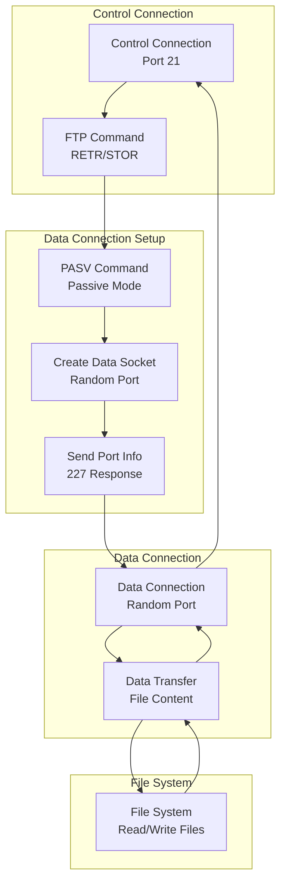

# Simple Secure FTP Daemon - Data Flow Diagrams

## FTP Control Connection Data Flow

```mermaid
flowchart LR
    subgraph "Client"
        C1[FTP Client]
    end

    subgraph "Network"
        N1[TCP Connection<br/>Port 21]
    end

    subgraph "Server Input"
        S1[TCP Socket<br/>Accept Connection]
        S2[Raw Bytes]
    end

    subgraph "Parsing"
        P1[CommandParser<br/>Parse FTP Command]
        P2[Parsed Command<br/>Command, Arguments]
    end

    subgraph "Command Processing"
        CP1[Command Handler<br/>Process Command]
        CP2[Command Result]
    end

    subgraph "Response Building"
        RB1[ResponseBuilder<br/>Build FTP Response]
        RB2[FTP Response<br/>Status Code, Message]
    end

    subgraph "Server Output"
        O1[TCP Socket<br/>Send Response]
        O2[TCP Connection]
    end

    C1 -->|FTP Command| N1
    N1 --> S1
    S1 --> S2
    S2 --> P1
    P1 --> P2
    P2 --> CP1
    CP1 --> CP2
    CP2 --> RB1
    RB1 --> RB2
    RB2 --> O1
    O1 --> O2
    O2 -->|FTP Response| C1
```

## FTP Data Transfer Flow

```mermaid
flowchart TB
    subgraph "Control Connection"
        CC1[Control Connection<br/>Port 21]
        CC2[FTP Command<br/>RETR/STOR]
    end

    subgraph "Data Connection Setup"
        DS1[PASV Command<br/>Passive Mode]
        DS2[Create Data Socket<br/>Random Port]
        DS3[Send Port Info<br/>227 Response]
    end

    subgraph "Data Connection"
        DC1[Data Connection<br/>Random Port]
        DC2[Data Transfer<br/>File Content]
    end

    subgraph "File System"
        FS1[File System<br/>Read/Write Files]
    end

    CC1 --> CC2
    CC2 --> DS1
    DS1 --> DS2
    DS2 --> DS3
    DS3 --> DC1
    DC1 --> DC2
    DC2 --> FS1
    FS1 --> DC2
    DC2 --> DC1
    DC1 --> CC1
```
