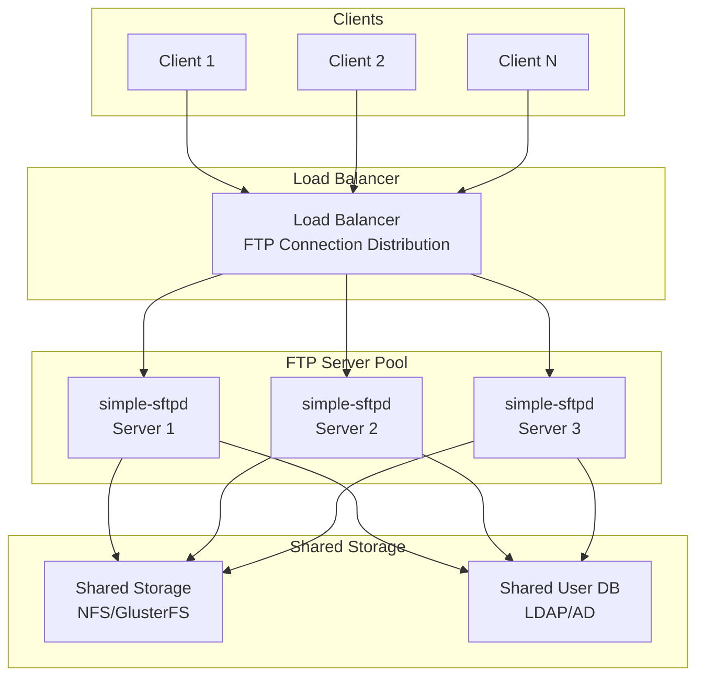

# Simple Secure FTP Daemon - Deployment Diagrams

## Basic Deployment Architecture

```mermaid
graph TB
    subgraph "Client Network"
        Client1[FTP Client 1]
        Client2[FTP Client 2]
        ClientN[FTP Client N]
    end

    subgraph "FTP Server"
        Server[simple-sftpd<br/>Main Process]
        Config[/etc/simple-sftpd/<br/>Configuration]
        UserDB[/etc/simple-sftpd/users<br/>User Database]
        Logs[/var/log/simple-sftpd/<br/>Access/Transfer Logs]
        DataDir[/var/ftp<br/>Data Directory]
    end

    subgraph "System Services"
        Systemd[systemd<br/>Service Manager]
        Logrotate[logrotate<br/>Log Rotation]
    end

    Client1 --> Server
    Client2 --> Server
    ClientN --> Server

    Systemd --> Server
    Systemd --> Config

    Server --> Config
    Server --> UserDB
    Server --> DataDir
    Server --> Logs

    Logrotate --> Logs
```

## High Availability FTP Deployment



## Virtual Hosting Deployment

```mermaid
graph TB
    subgraph "FTP Server"
        Server[simple-sftpd<br/>Multi-Domain Server]
        VirtualHost1[Virtual Host 1<br/>ftp.example1.com]
        VirtualHost2[Virtual Host 2<br/>ftp.example2.com]
        VirtualHostN[Virtual Host N<br/>ftp.exampleN.com]
    end

    subgraph "Domain 1"
        Client1_1[Client 1.1]
        Client1_2[Client 1.2]
        DataDir1[/var/ftp/example1<br/>Domain 1 Data]
    end

    subgraph "Domain 2"
        Client2_1[Client 2.1]
        Client2_2[Client 2.2]
        DataDir2[/var/ftp/example2<br/>Domain 2 Data]
    end

    Client1_1 --> VirtualHost1
    Client1_2 --> VirtualHost1
    Client2_1 --> VirtualHost2
    Client2_2 --> VirtualHost2

    VirtualHost1 --> DataDir1
    VirtualHost2 --> DataDir2

    Server --> VirtualHost1
    Server --> VirtualHost2
    Server --> VirtualHostN
```
