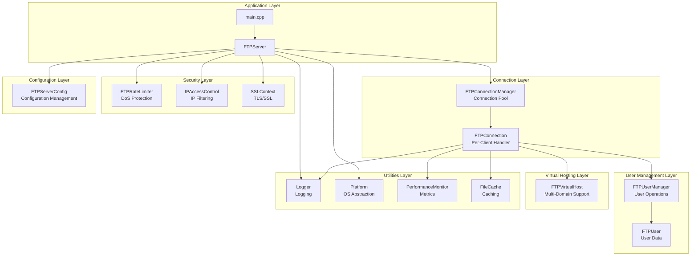
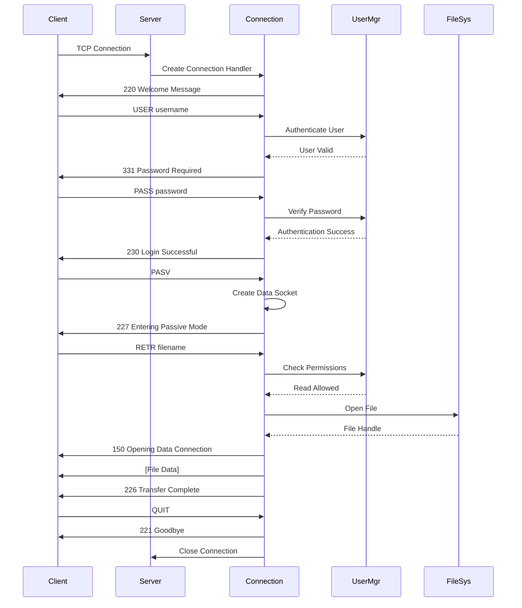
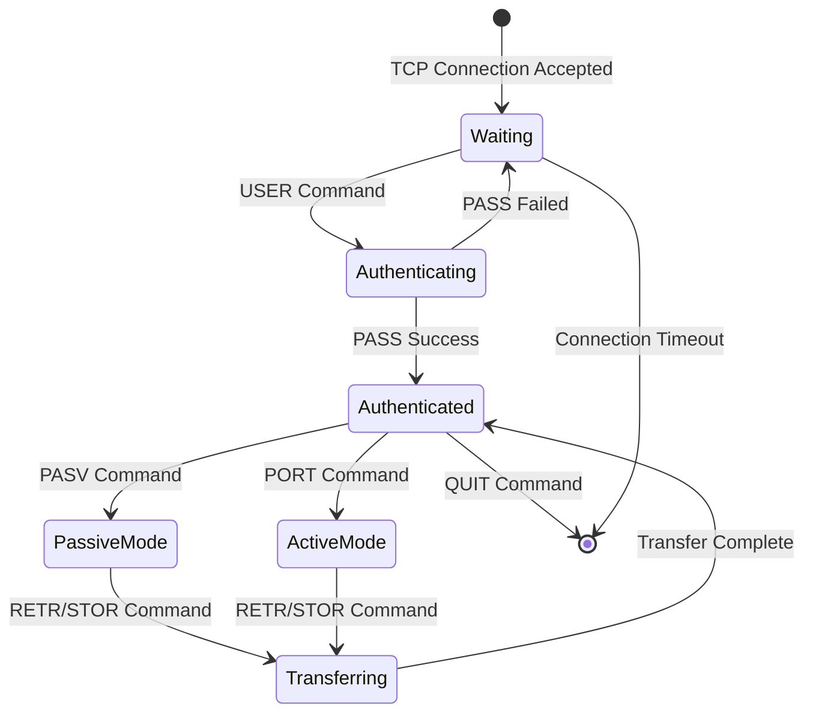

# Simple Secure FTP Daemon - Architecture Diagrams

## System Architecture

```mermaid
graph TB
    subgraph "Application Layer"
        Main[main.cpp]
        Server[FTPServer]
    end
    
    subgraph "Connection Layer"
        ConnMgr[FTPConnectionManager<br/>Connection Pool]
        Connection[FTPConnection<br/>Per-Client Handler]
    end
    
    subgraph "User Management Layer"
        UserMgr[FTPUserManager<br/>User Operations]
        User[FTPUser<br/>User Data]
    end
    
    subgraph "Virtual Hosting Layer"
        VirtualHost[FTPVirtualHost<br/>Multi-Domain Support]
    end
    
    subgraph "Security Layer"
        RateLimiter[FTPRateLimiter<br/>DoS Protection]
        AccessControl[IPAccessControl<br/>IP Filtering]
        SSLContext[SSLContext<br/>TLS/SSL]
    end
    
    subgraph "Configuration Layer"
        Config[FTPServerConfig<br/>Configuration Management]
    end
    
    subgraph "Utilities Layer"
        Logger[Logger<br/>Logging]
        Platform[Platform<br/>OS Abstraction]
        PerfMon[PerformanceMonitor<br/>Metrics]
        FileCache[FileCache<br/>Caching]
    end
    
    Main --> Server
    Server --> ConnMgr
    Server --> Config
    Server --> Logger
    Server --> RateLimiter
    Server --> AccessControl
    Server --> SSLContext
    
    ConnMgr --> Connection
    Connection --> UserMgr
    Connection --> VirtualHost
    Connection --> Logger
    Connection --> PerfMon
    Connection --> FileCache
    
    UserMgr --> User
    Server --> Platform
```

## FTP Command Processing Flow

```mermaid
sequenceDiagram
    participant Client
    participant Server
    participant Connection
    participant UserMgr
    participant FileSys
    
    Client->>Server: TCP Connection
    Server->>Connection: Create Connection Handler
    Connection->>Client: 220 Welcome Message
    
    Client->>Connection: USER username
    Connection->>UserMgr: Authenticate User
    UserMgr-->>Connection: User Valid
    Connection->>Client: 331 Password Required
    
    Client->>Connection: PASS password
    Connection->>UserMgr: Verify Password
    UserMgr-->>Connection: Authentication Success
    Connection->>Client: 230 Login Successful
    
    Client->>Connection: PASV
    Connection->>Connection: Create Data Socket
    Connection->>Client: 227 Entering Passive Mode
    
    Client->>Connection: RETR filename
    Connection->>UserMgr: Check Permissions
    UserMgr-->>Connection: Read Allowed
    Connection->>FileSys: Open File
    FileSys-->>Connection: File Handle
    Connection->>Client: 150 Opening Data Connection
    Connection->>Client: [File Data]
    Connection->>Client: 226 Transfer Complete
    
    Client->>Connection: QUIT
    Connection->>Client: 221 Goodbye
    Connection->>Server: Close Connection
```

## Connection Lifecycle

```mermaid
stateDiagram-v2
    [*] --> Waiting: TCP Connection Accepted
    Waiting --> Authenticating: USER Command
    Authenticating --> Authenticated: PASS Success
    Authenticating --> Waiting: PASS Failed
    Authenticated --> PassiveMode: PASV Command
    Authenticated --> ActiveMode: PORT Command
    PassiveMode --> Transferring: RETR/STOR Command
    ActiveMode --> Transferring: RETR/STOR Command
    Transferring --> Authenticated: Transfer Complete
    Authenticated --> [*]: QUIT Command
    Waiting --> [*]: Connection Timeout
```

