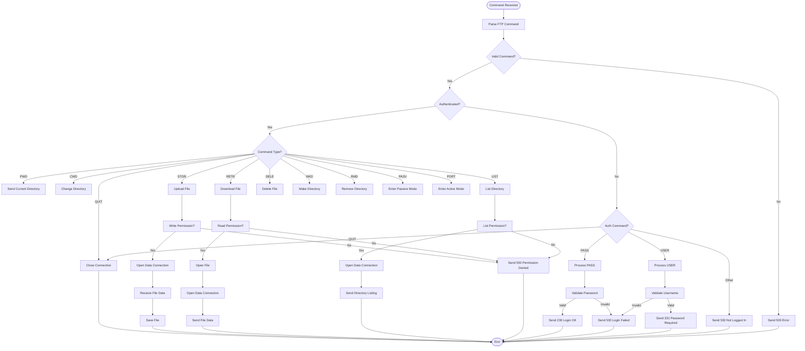
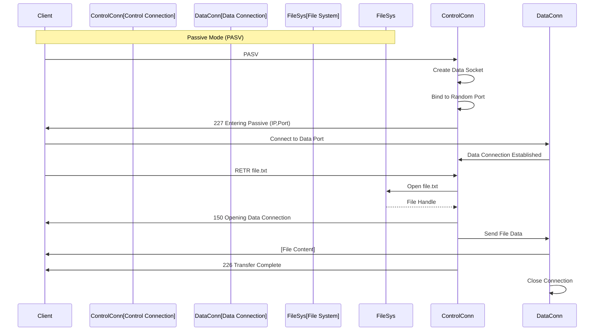

# Simple Secure FTP Daemon - Flow Diagrams

## FTP Command Processing Flow

```mermaid
flowchart TD
    Start([Command Received]) --> Parse[Parse FTP Command]
    Parse --> Validate{Valid Command?}
    Validate -->|No| SendError[Send 500 Error]
    Validate -->|Yes| CheckAuth{Authenticated?}
    
    CheckAuth -->|No| AuthCommands{Auth Command?}
    AuthCommands -->|USER| HandleUSER[Process USER]
    AuthCommands -->|PASS| HandlePASS[Process PASS]
    AuthCommands -->|QUIT| HandleQUIT[Process QUIT]
    AuthCommands -->|Other| SendAuthError[Send 530 Not Logged In]
    
    CheckAuth -->|Yes| RouteCommand{Command Type?}
    
    RouteCommand -->|PWD| HandlePWD[Send Current Directory]
    RouteCommand -->|CWD| HandleCWD[Change Directory]
    RouteCommand -->|LIST| HandleLIST[List Directory]
    RouteCommand -->|RETR| HandleRETR[Download File]
    RouteCommand -->|STOR| HandleSTOR[Upload File]
    RouteCommand -->|DELE| HandleDELE[Delete File]
    RouteCommand -->|MKD| HandleMKD[Make Directory]
    RouteCommand -->|RMD| HandleRMD[Remove Directory]
    RouteCommand -->|PASV| HandlePASV[Enter Passive Mode]
    RouteCommand -->|PORT| HandlePORT[Enter Active Mode]
    RouteCommand -->|QUIT| HandleQUIT[Close Connection]
    
    HandleUSER --> CheckUser[Validate Username]
    CheckUser -->|Valid| Send331[Send 331 Password Required]
    CheckUser -->|Invalid| Send530[Send 530 Invalid User]
    
    HandlePASS --> CheckPass[Validate Password]
    CheckPass -->|Valid| Send230[Send 230 Login OK]
    CheckPass -->|Invalid| Send530[Send 530 Login Failed]
    
    HandleLIST --> CheckPerm[List Permission?]
    CheckPerm -->|Yes| OpenDataConn[Open Data Connection]
    CheckPerm -->|No| Send550[Send 550 Permission Denied]
    OpenDataConn --> SendList[Send Directory Listing]
    
    HandleRETR --> CheckRead[Read Permission?]
    CheckRead -->|Yes| OpenFile[Open File]
    CheckRead -->|No| Send550
    OpenFile --> OpenDataConn2[Open Data Connection]
    OpenDataConn2 --> SendFile[Send File Data]
    
    HandleSTOR --> CheckWrite[Write Permission?]
    CheckWrite -->|Yes| OpenDataConn3[Open Data Connection]
    CheckWrite -->|No| Send550
    OpenDataConn3 --> ReceiveFile[Receive File Data]
    ReceiveFile --> SaveFile[Save File]
    
    SendError --> End([End])
    SendAuthError --> End
    Send331 --> End
    Send530 --> End
    Send230 --> End
    Send550 --> End
    SendList --> End
    SendFile --> End
    SaveFile --> End
    HandleQUIT --> End
```

## Data Connection Flow

```mermaid
sequenceDiagram
    participant Client
    participant ControlConn[Control Connection]
    participant DataConn[Data Connection]
    participant FileSys[File System]
    
    Note over Client,FileSys: Passive Mode (PASV)
    Client->>ControlConn: PASV
    ControlConn->>ControlConn: Create Data Socket
    ControlConn->>ControlConn: Bind to Random Port
    ControlConn->>Client: 227 Entering Passive (IP,Port)
    Client->>DataConn: Connect to Data Port
    DataConn->>ControlConn: Data Connection Established
    Client->>ControlConn: RETR file.txt
    ControlConn->>FileSys: Open file.txt
    FileSys-->>ControlConn: File Handle
    ControlConn->>Client: 150 Opening Data Connection
    ControlConn->>DataConn: Send File Data
    DataConn->>Client: [File Content]
    ControlConn->>Client: 226 Transfer Complete
    DataConn->>DataConn: Close Connection
```

